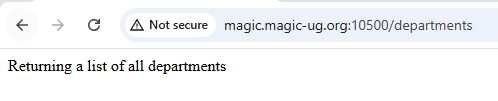

# 3. Routes

A RESTful application uses the REQUEST METHOD and URL to provide functionality.  

## Request Method
- GET  
    - Fetch/Retrieve a resource  
- PUT  
    - Add or Update a entire resource
- POST  
    - Add a new resource
- DELETE  
    - Delete a resource
- PATCH  
    - Update specific attributes of a resource

⚠️ The actions taken by a particular request method are determined by the API.  
If the person who implemented the API wants to delete resources when a GET request is made, they are free to do that.  
They won't have a very popular API, but they could do it.

The API documentation *should* identify exactly what happens for each request method.  


## URL Path
The URL path will identify the resource that you want to work with.  
A request to `/customers` would be working with all customers.  
A request to `/customers/123` would act upon customer #123.  

⚠️ Again, what the API actually does is totally up to whoever implemented it.  
The API documentation *should* identify the URL paths and what they represent.   


## Method + Path
The Request Method + Path define a "route" in the application.  
For our workshop, the following routes are available:

  
The full API documentation is available [here](https://gist.github.com/worksofliam/600cddab687bdd127c7b8e1dfd456cde)  


If you want a list of all employees, you make a `GET` request to the `/employees` path.  
If you want to update employee #150, you make a `PATCH` request to the `/employees/150` path.  
  

## Front-Controller

It is the job of the front-controller to inspect the incoming request and perform the appropriate actions.  
Let's look at how we can inspect the incoming request in PHP...  

<br>➡️ Update `index.php` so that it looks like this:  
```
<?php

$method = $_SERVER["REQUEST_METHOD"];
$path = $_SERVER["REQUEST_URI"];

if ($method == 'GET' && $path == '/employees') {
    print('Returning a list of all employees');
}

elseif ($method == 'GET' && $path == '/departments') {
    print('Returning a list of all departments');
}

else {
    print('Some other route was requested');
}
```

We are loading the request method and path from the incoming HTTP request into variables `$method` and `$path`.  
We then check to see which route was requested.  
⚠️To compare two values in PHP you use two equal signs together.  
❗❗ If you forget and only use 1 equal sign (like we do in RPG) your app will not work correctly.


<br>➡️ Open your browser and go to `http://magic.magic-ug.org:{your_port}/employees`  
You should see something like this:  
  


<br>➡️ Open your browser and go to `http://magic.magic-ug.org:{your_port}/departments`  
You should see something like this:  
  


<br>➡️ Open your browser and go to `http://magic.magic-ug.org:{your_port}`  
➡️ Open your browser and go to `http://magic.magic-ug.org:{your_port}/employees/150`  
➡️ Open your browser and go to `http://magic.magic-ug.org:{your_port}/departments/A00`  
If you make a request to any other path, you should see something like this:  
  


## 🚀 Congratulations!
If you were able to return the responses shown above, it's success!  
You have determined the requested route in your app and sent back an appropriate HTTP response!

Now we need to actually send back the data that was requested...lets do that in the next section!
