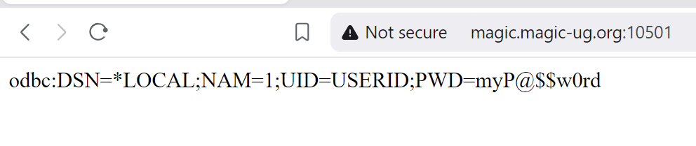
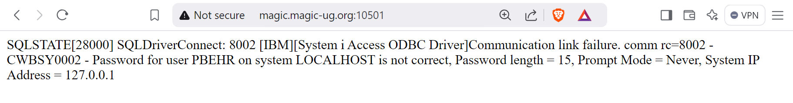
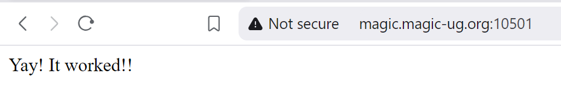
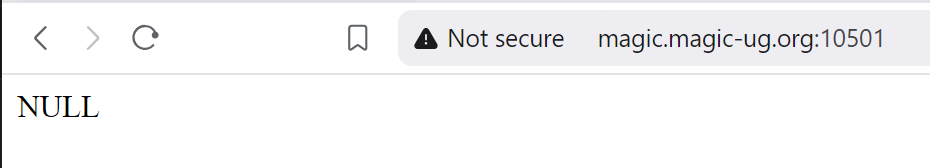
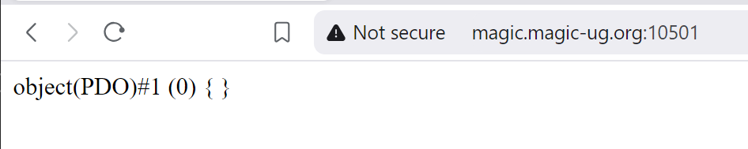
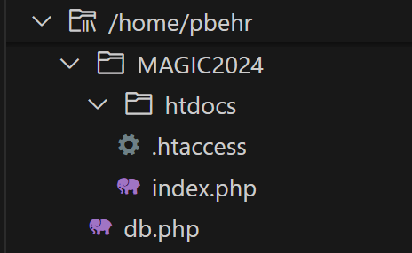

# Database connection

## Connection string
Unlike RPG, for PHP the database is not integrated; we have to create a connection to it.  
In order to connect to the database we must provide a connection string.  
There are quite a few things that you can specify in the connection string; for our purpose we will specify a DSN, a user/password, and the database naming convention we want to use. 

The first part of the connection string will be the DSN (Data Source Name).  The DSN contains information about the database connection, such as a description, the databse driver to use, and the system name.  When you install ODBC on IBM i, it will create a default DSN called *LOCAL, and it looks like this (found in the IFS at `/QOpenSys/etc/odbc.ini`):  
```
### IBM provided DSN - do not remove this line ###
[*LOCAL]
Description = Default IBM i local database
Driver      = IBM i Access ODBC Driver
System      = localhost
UserID      = *CURRENT
### Start of DSN customization
### End of DSN customization
### IBM provided DSN - do not remove this line ###
```

The second part of the connection string will be *your* user id and password.  

Finally we will specify that we want to use *SYSTEM naming (uses the library list) instead of *SQL naming (uses the default schema).  


<br>➡️ Update `index.php` so that it looks like this: 
```
<?php

$dsn = '*LOCAL';     // Use the *LOCAL DSN
$user = 'USERID';    // Use your userid
$pwd = 'myP@$$w0rd'; // Use your password
$naming = '1';       // NAM=1 means *SYS naming (uses the library list)
$connection_string = "odbc:DSN={$dsn};NAM={$naming};UID={$user};PWD={$pwd}";

print($connection_string);
```
We are declaring the variables we need to build the connection string: the DSN, user, password, and the naming convention.  Then we use those variables to build the connection string.  Instead of using concatenation with dots (i.e. 'Var 1 ' . $var1 . ' and Var 2 ' .$var2) we're using interpolation...if we use double quotes for the string we can add variables directly into the string without having to concatenate (i.e. "Var 1 {$var1} and Var 2 {$var2}").   
This is not important for connecting to the database, just a little PHP info.


<br>➡️ Open your browser and go to `http://magic.magic-ug.org:{your_port}`   
You should see something like this:  
  


## Database Connection
Now that we have built the connection string, let's use it to connect to the database.  

<br>➡️ Update `index.php` so that it looks like this: 
```
<?php

$dsn = '*LOCAL';     // Use the *LOCAL DSN
$user = 'USERID';    // Use your userid
$pwd = 'myP@$$w0rd'; // Use your password
$naming = '1';       // NAM=1 means *SYS naming (uses the library list)
$connection_string = "odbc:DSN={$dsn};NAM={$naming};UID={$user};PWD={$pwd}";
$dbConn = NULL;

try {
    $dbConn = new PDO($connection_string);
    print('Yay! It worked!!');
} catch (PDOException $exception) {
    echo $exception->getMessage();
} 
exit;
 ```
 This builds the connection string, same as before.  We're now using the connection string to create a database connection on line 10.  
 This code is inside a try/catch block, which is similar to the `monitor/on-error` code we use in RPG.  It will attempt to run the code inside the `try` (like the monitor part in RPG).  If there are any errors it will call the code inside the `catch` block (like the on-error part in RPG).   

 So, if the database connection is successful it will print "Yay! It worked!!".  
 If there was an error it will print the exception message (⚠️you might not want to print the actual error message in production).

Finally we have the `exit` command, which ends the script (not really required in this case, but useful if you want to exit the script early).  
 
<br>➡️ Open your browser and go to `http://magic.magic-ug.org:{your_port}`  

If you forgot to update something and the connection fails, you will see something like this:  
   


If it worked correctly you should see something like this:   
  


## Functions
The code to connect to the database might be useful in other places.  To make this code reusable, we can create a function (functions in PHP are like procedures in RPG).  


<br>➡️ Update `index.php` so that it looks like this: 
```
<?php

function get_db_conn() {
    $dsn = '*LOCAL';     // Use the *LOCAL DSN
    $user = 'userid';    // Use your userid
    $pwd = 'password';   // Use your password
    $naming = '1';       // NAM=1 means *SYS naming (uses the library list)
    $connection_string = "odbc:DSN={$dsn};NAM={$naming};UID={$user};PWD={$pwd}";
    $dbConn = NULL;
    
    try {
        $dbConn = new PDO($connection_string);
    } catch (PDOException $exception) {
        error_log($exception->getMessage());
    } 

    return $dbConn;
}

$dbConn = get_db_conn();
var_dump( $dbConn );
exit;
```

We create a function with the `function` keyword on line 3.  The function keyword is followed by parenthesis, where input parameters would be defined (this function doesn't have any input parms).  The body of the function is then defined inside curly brackets:  
```
function name_of_function (input parms here) { function body here }
```  

The code inside the function is the same database connection code we had before...we've just moved it into a function.  

After the function definition we call the function on line 13 `get_db_conn()`, and store the return value in the `$dbConn` variable.  

Then we use `var_dump($dbConn)` to display the contents of the $dbConn variable, and then we exit the script.  


<br>➡️ Open your browser and go to `http://magic.magic-ug.org:{your_port}`  


If something went wrong, you will see something like this:  
   

If everything is working, you should see something like this:   
   


## Separate files  
We have the database connection in a function now, but it would be even better if we could separate the database functionality from the API functionality even more.  


<br>➡️ In your /magic2024 directory, create a file named `db.php`  
❗ make sure this file is in magic2024 and *not* in htdocs.  


Your file structure should look like this:   
  

<br>➡️ Add the database connection function to the new `db.php` file so that it looks like this: 
```
<?php

function get_db_conn() {
    $dsn = '*LOCAL';     // Use the *LOCAL DSN
    $user = 'userid';    // Use your userid
    $pwd = 'password';   // Use your password
    $naming = '1';       // NAM=1 means *SYS naming (uses the library list)
    $connection_string = "odbc:DSN={$dsn};NAM={$naming};UID={$user};PWD={$pwd}";
    $dbConn = NULL;
    
    try {
        $dbConn = new PDO($connection_string);
    } catch (PDOException $exception) {
        error_log($exception->getMessage());
    } 

    return $dbConn;
}
```

Now we can remove the database function from `index.php`.php.    
<br>➡️ Update `index.php` file so that it looks like this: 
```
<?php

include '../db.php';

$dbConn = get_db_conn();
var_dump( $dbConn );
exit;
```  
The `/include` in PHP is the same as /include (or /copy) in RPG...we copy in the source from `db.php`.  We then call the `get_db_conn` function to get a database connection.  


<br>➡️ Open your browser and go to `http://magic.magic-ug.org:{your_port}`  
If everything is still working, you should see something like this again:   
   


## 🚀 Congratulations!
We now have a connection to the database, and we are now ready to start fetching data and returning results!