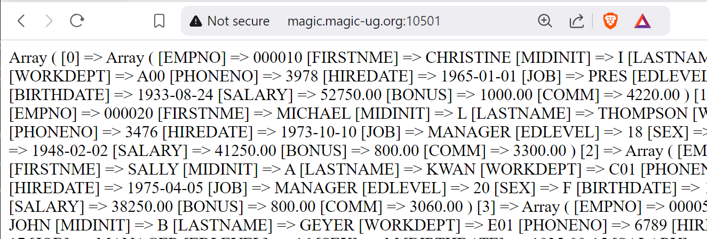
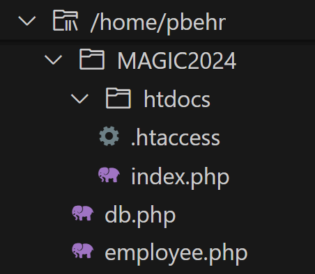
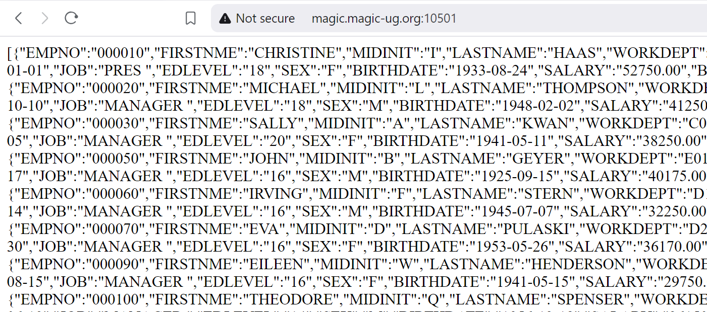

# Employees

Now it's time to fetch some data and return results!

<br>➡️ Update `index.php` so that it looks like this:  
```
<?php

include '../db.php';

$dbConn = get_db_conn();

try {
    $sql = "select * from SAMPLE.EMPLOYEE";
    $query = $dbConn->prepare($sql);
    $query->execute(); 
    $rows = $query->fetchAll();
    print_r($rows); 
} catch (PDOException $exception) {
    echo $exception->getMessage();
    exit;
} 
```
After we get our database connection we are going to build an SQL statement and run it.  
We build the SQL statement `$sql = "select * from SAMPLE.EMPLOYEE";`   
Prepare the SQL statement `$query = $dbConn->prepare($sql);`   
Execute the SQL statement `$query->execute();`   
And then fetch the results `$rows = $query->fetchAll();`    
The results in the variable `$rows` will be a PHP array.  

<br>➡️ Open your browser and go to `http://magic.magic-ug.org:{your_port}`  

You should see something like this:  
  

Yay! We are fetching data from the database and returning it to the browser...that's awesome!

## Separate Files
We now want to make a few changes: let's convert this code into a function, move this code into a separate file, and let's return JSON instead of a PHP array.


<br>➡️ In your /magic2024 directory, create a file named `employee.php`  
❗ make sure this file is in magic2024 and *not* in htdocs.  


Your file structure should look like this:   
  


<br>➡️ Paste this code into `employee.php` so that it looks like this: 
```
<?php

function get_all_employees() {
    $dbConn = get_db_conn();

    try {
        $sql = "select * from SAMPLE.EMPLOYEE";
        $query = $dbConn->prepare($sql);
        $query->execute(); 
        $rows = $query->fetchAll();
        return $rows; 
    } catch (PDOException $exception) {
        echo $exception->getMessage();
        return NULL;
    } 
}
```
We now have a function we can call to fetch all the employees.
We want to change our `index.php` to call this new function.  


<br>➡️ Update `index.php` so that it looks like this:
```
<?php

include '../db.php';
include '../employee.php';

$employees = get_all_employees();
print(json_encode($employees));
```

First we include the employee file,  
Then we call our new function and get an array of all the employees,  
Then we use the `json_encode` function to convert the PHP array into JSON, and print the results.  


<br>➡️ Open your browser and go to `http://magic.magic-ug.org:{your_port}`  

You should see something like this:  
  

This is the same employee data, now formatted as JSON.


## 🚀 Congratulations!
We are now able to return the employee data as JSON!
Now let's do the same thing for the departments.