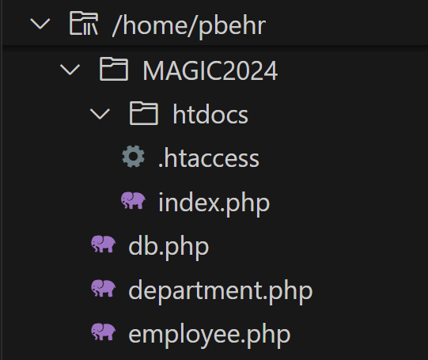
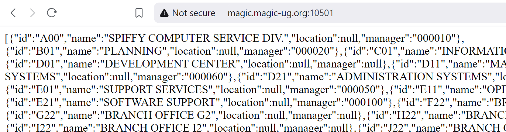
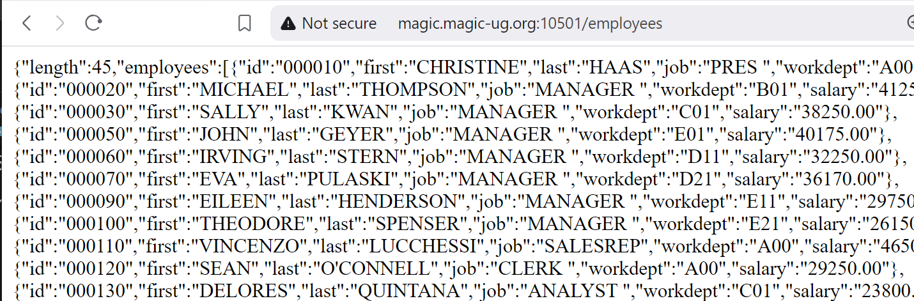
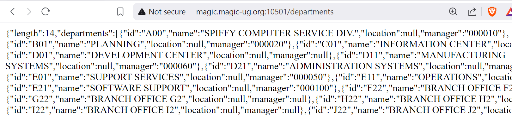

# Departments
Now we will do the same thing for the departments.  

<br>➡️ In your /magic2024 directory, create a file named `department.php`  
❗ make sure this file is in magic2024 and *not* in htdocs.  


Your file structure should look like this:   
  


<br>➡️ Paste this code into `department.php` so that it looks like this: 
```
<?php

function get_all_departments() {
    $dbConn = get_db_conn();

    try {
        $sql = <<<SQL
            select 
                DEPTNO as "id",
                DEPTNAME as "name",
                LOCATION as "location",
                MGRNO as "manager"
            from SAMPLE.DEPARTMENT
        SQL;
        $query = $dbConn->prepare($sql);
        $query->execute(); 
        $rows = $query->fetchAll(PDO::FETCH_ASSOC);
        return $rows; 
    } catch (PDOException $exception) {
        echo $exception->getMessage();
        return NULL;
    } 
}
```


Let's update `index.php` to call this new function to get all the departments.  

<br>➡️ Update `index.php` so that it looks like this:
```
<?php

include '../db.php';
include '../department.php';

$departments = get_all_departments();
print(json_encode($departments));
```


<br>➡️ Open your browser and go to `http://magic.magic-ug.org:{your_port}`  

You should see something like this:  
   


## Routing
Let's add some routing back into `index.php`.  
A GET request to the `/employees` route should return all employees, and a GET request to `/departments` should return all departments.  

<br>➡️ Update `index.php` so that it looks like this:
```
<?php

include '../db.php';
include '../employee.php';
include '../department.php';

$method = $_SERVER["REQUEST_METHOD"];
$path = $_SERVER["REQUEST_URI"];

if ($method == 'GET' && $path == '/employees') {
    $employees = get_all_employees();
    print(json_encode($employees));
}

elseif ($method == 'GET' && $path == '/departments') {
    $departments = get_all_departments();
    print(json_encode($departments));
}

else {
    print('Some other route was requested');
}
```


<br>➡️ Open your browser and go to `http://magic.magic-ug.org:{your_port}/employees`  

You should see something like this:  
   


<br>➡️ Open your browser and go to `http://magic.magic-ug.org:{your_port}/departments`  

You should see something like this:  
   


## 🚀 Congratulations!
We are now able to return the employees and departments as JSON!
Now let's look at how to get the data for a single employee or department!
