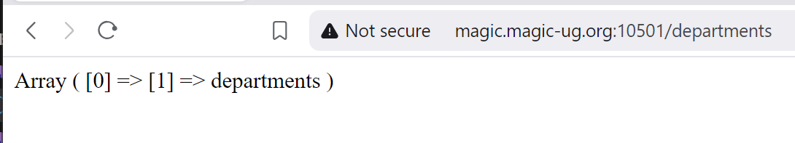
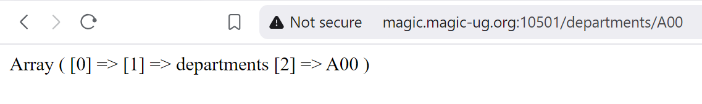
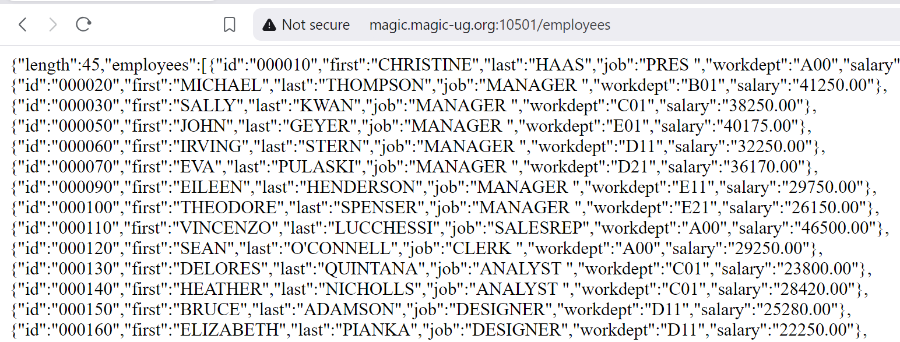
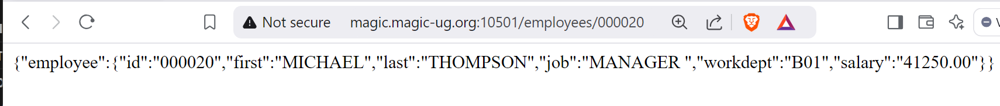
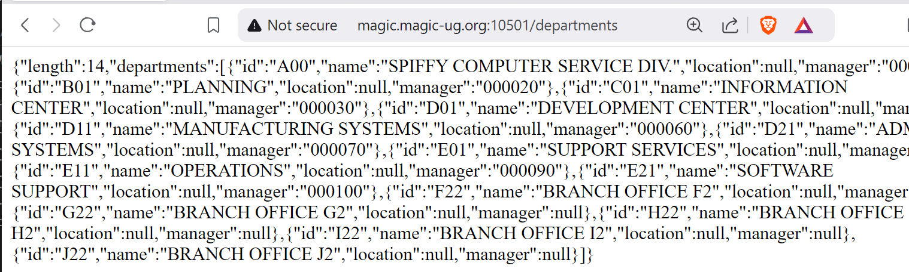

# Parameters

We now have an app that can return *all* employees, or *all* departments.  
We also want to be able to return a specific employee or department.  We will also need to update a specific employee or department, and may want to add functionality to delete a specific record in the future.  

## Path parameters
The first thing we will do is parse the employee or department number from the incoming request URL Path.  

<br>➡️ Update `index.php` so that it looks like this:
```
<?php

$method = $_SERVER["REQUEST_METHOD"];
$path = $_SERVER["REQUEST_URI"];

$urlParts = explode('/', $path);
print_r($urlParts);
exit;
```
We use the `explode` function to split the path at each slash.  


<br>➡️ Open your browser and go to `http://magic.magic-ug.org:{your_port}/departments`  

You should see something like this:  
  


<br>➡️ Open your browser and go to `http://magic.magic-ug.org:{your_port}/departments/A00`  

You should see something like this:  
  


We now have an array that contains all the parts of the URL Path.  
The path will always start with a forward slash so the first array element is going to be blank.  
We can use the second array element to determine if we should return employees or departments.  
The third array element, if present, will be the employee or department id.  

Now let's add this to our routing.  

<br>➡️ Update `index.php` so that it looks like this:
```
<?php

$method = $_SERVER["REQUEST_METHOD"];
$path = $_SERVER["REQUEST_URI"];
$urlParts = explode('/', $path);


if ($method == 'GET' && $path == '/employees') {
    print('A request for all employees');
}

elseif ($method == 'GET' && $urlParts[1] == 'employees' && $urlParts[2]) {
    print('A request for employee id ' . $urlParts[2]);
}

elseif ($method == 'GET' && $path == '/departments') {
    print('A request for all departments');
}

elseif ($method == 'GET' && $urlParts[1] == 'departments' && $urlParts[2]) {
    print('A request for department id ' . $urlParts[2]);
}

else {
    print('Some other route was requested');
}
exit;
```
Our routing is now checking for *all* employees and departments, and is also checking for *specific* employees and departments...very cool!  


<br>➡️ Open your browser and go to `http://magic.magic-ug.org:{your_port}/departments`  
<br>➡️ Open your browser and go to `http://magic.magic-ug.org:{your_port}/departments/A00`  
<br>➡️ Open your browser and go to `http://magic.magic-ug.org:{your_port}/employees`  
<br>➡️ Open your browser and go to `http://magic.magic-ug.org:{your_port}/employees/000010`  


## SQL Parameter markers
Now we want to fetch specific customers and departments from the database.   
We will create a new function to return a single employee.  


<br>➡️ Add a new function to `employee.php` so that it looks like this:  
❗ Do not delete the `get_all_employees` function!  Just **add** this new function.  
```
<?php

function get_employee($empno) {
    $dbConn = get_db_conn();

    try {
        $sql = <<<SQL
            select 
                empno as "id",
                firstnme as "first",
                lastname as "last",
                job as "job",
                workdept as "workdept",
                salary as "salary"
            from SAMPLE.EMPLOYEE
            where empno = ?
        SQL;
        $query = $dbConn->prepare($sql);
        $query->bindParam(1, $empno);
        $query->execute(); 
        $row = $query->fetch(PDO::FETCH_ASSOC);
        return $row; 
    } catch (PDOException $exception) {
        echo $exception->getMessage();
        return NULL;
    } 
}


function get_all_employees() {
    DO NOT DELETE THE get_all_employees FUNCTION!
}
```
This new function accepts a parameter `$empno`.  
When we build the SQL statement, we use a parameter marker to select a specific employee.  After we prepare the SQL statement, we bind the `$empno` function parameter to the SQL parameter marker.  

<br>➡️ Update `index.php` so that it looks like this:  
```
<?php

include '../db.php';
include '../employee.php';

$method = $_SERVER["REQUEST_METHOD"];
$path = $_SERVER["REQUEST_URI"];
$urlParts = explode('/', $path);

if ($method == 'GET' && $path == '/employees') {
    $employees = get_all_employees();
    $returnObj = array(
        "length" => count($employees),
        "employees" => $employees
    );
    print(json_encode($returnObj));
}

elseif ($method == 'GET' && $urlParts[1] == 'employees' && $urlParts[2]) {
    $employee = get_employee($urlParts[2]);
    $returnObj = array(
        "employee" => $employee
    );
    print(json_encode($returnObj));
}

else {
    print('Some other route was requested');
}
exit;
```

When a request for all employees comes in we return the count and array of employees.  
➡️ Open your browser and go to `http://magic.magic-ug.org:{your_port}/employees`  

You should see something like this:  
  


When a request for a specific customer comes in, we will call our new function to fetch that employee and then display the customer.  
➡️ Open your browser and go to `http://magic.magic-ug.org:{your_port}/employees/000020`  

You should see something like this:  
  


## Departments
Now let's do the same thing for the departments...  

➡️ Add a new function to `department.php` so that it looks like this:  
❗ Do not delete the `get_all_departments` function!  Just **add** this new function.  
```
<?php

function get_department($deptno) {
    $dbConn = get_db_conn();

    try {
        $sql = <<<SQL
            select 
                DEPTNO as "id",
                DEPTNAME as "name",
                LOCATION as "location",
                MGRNO as "manager"
            from SAMPLE.DEPARTMENT
            where deptno = ?
        SQL;
        $query = $dbConn->prepare($sql);
        $query->bindParam(1, $deptno);
        $query->execute(); 
        $row = $query->fetch(PDO::FETCH_ASSOC);
        return $row; 
    } catch (PDOException $exception) {
        echo $exception->getMessage();
        return NULL;
    } 
}

function get_all_departments() {
    DO NOT DELETE THE get_all_departments FUNCTION!
}
```
<br>
And then we will add the department routes back into index.php...    

➡️ Update `index.php` so that it looks like this:  
```
<?php

include '../db.php';
include '../employee.php';
include '../department.php';

$method = $_SERVER["REQUEST_METHOD"];
$path = $_SERVER["REQUEST_URI"];
$urlParts = explode('/', $path);

if ($method == 'GET' && $path == '/employees') {
    $employees = get_all_employees();
    $returnObj = array(
        "length" => count($employees),
        "employees" => $employees
    );
    print(json_encode($returnObj));
}

elseif ($method == 'GET' && $urlParts[1] == 'employees' && $urlParts[2]) {
    $employee = get_employee($urlParts[2]);
    $returnObj = array(
        "employee" => $employee
    );
    print(json_encode($returnObj));
}

elseif ($method == 'GET' && $path == '/departments') {
    $departments = get_all_departments();
    $returnObj = array(
        "length" => count($departments),
        "departments" => $departments
    );
    print(json_encode($returnObj));
}

elseif ($method == 'GET' && $urlParts[1] == 'departments' && $urlParts[2]) {
    $department = get_department($urlParts[2]);
    $returnObj = array(
        "department" => $department
    );
    print(json_encode($returnObj));
}
else {
    print('Some other route was requested');
}
exit;
```


When a request for all departments comes in we return the count and array of departments.  
➡️ Open your browser and go to `http://magic.magic-ug.org:{your_port}/departments`  

You should see something like this:  
  


When a request for a specific department comes in, we will call our new function to fetch that department and then display the customer.  
➡️ Open your browser and go to `http://magic.magic-ug.org:{your_port}/departments/A00`  

You should see just department A00

## 🚀 Congratulations!
We have implemented 4 of the 8 routes!!  
As you can see, the `index.php` is starting to get a little bit hard to understand already...and we're only 1/2 way through!!  We also need the ability to send back HTTP status codes, and read the HTTP Request body for updates and inserts.  
In the next section we will begin to use the Slim framework to make `index.php` cleaner and easier to understand.  
