# Slim Framework

Slim is a PHP micro framework that helps you quickly write simple yet powerful web applications and APIs.  
We will be totally revamping the application.  

## Clean up    

➡️ Delete the files `db.php`, `department.php`, and `employee.php`.  

Your file structure should now look like this:  
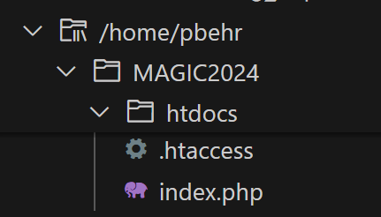    


## Install Slim  
We use Composer to install the Slim framework, and we use the terminal command line to use Composer.    

Open the IBM i PASE terminal. 
<br>➡️ Press `Ctl+Shift+J` to launch the IBM i Terminal picker, and then select PASE    
    

This will open a Bash terminal:  
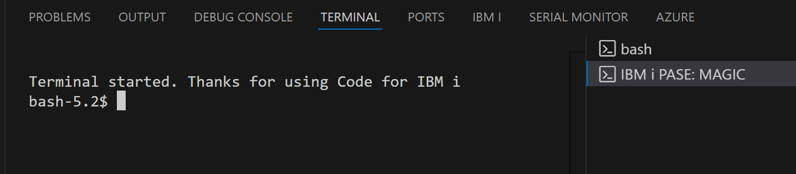  


By default your current working directory in the terminal will be your /home folder.  To see what your working directory is, type `pwd` into the terminal and then press &lt;Enter&gt;:  
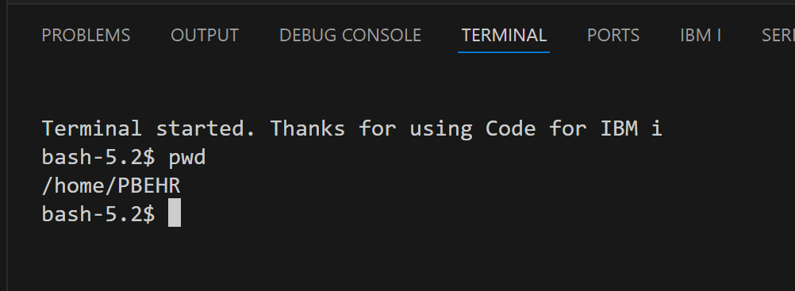  

We want to work in the magic2024 folder, so we need to change directory into magic2024.  
➡️ Type `cd magic2024` and then press &lt;Enter&gt;.  
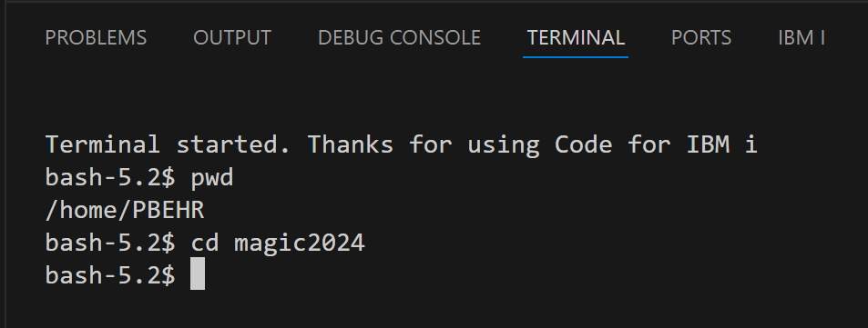  

You can double check that you are now in the magic2024 directory by using the `pwd` command again.  

Now that we're in the proper directory, we can use Composer to add Slim to our project.  
➡️ In the terminal type `composer require slim/slim slim/psr7` and then press &lt;Enter&gt;.  
Composer will install Slim, and all it's dependencies, in a folder called vendor.  It will also create a couple of files called composer.json and composer.lock.  

Your file structure should now look like this (you might need to update the IFS Browser):  
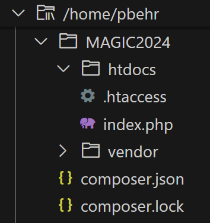    

Composer has really cool auto-loading capability that we will want to take advantage of.  
In order to use the autoloader we will want to rearrange our project a little bit.  
We will move all the application files into a new folder called `src`.  
➡️ Inside /magic2024, create a new folder called `src`.  

Add a file for our database logic.  
➡️ Inside /src, create a new file called `Db.php`.  

Your file structure should now look like this:  
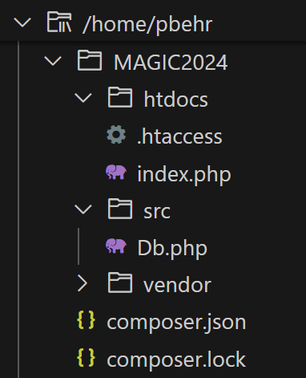    


We will be splitting the functionality for employees and departments into "models" and "controllers".  
Models will deal with the database, and controllers will deal with the HTTP request/response.  


➡️ Inside the /src folder, create a new folder called `Controller`.  
➡️ In the /Controller folder, create a file called `DepartmentController.php`   
➡️ In the /Controller folder, create a file called `EmployeeController.php`  

Your file structure should now look like this:  
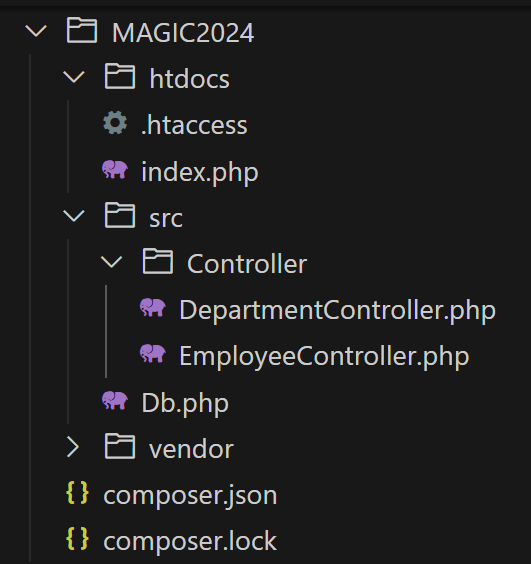    


➡️ Inside the /src folder, create a new folder called `Model`.  
➡️ In the /Model folder, create a file called `DepartmentModel.php`   
➡️ In the /Model folder, create a file called `EmployeeModel.php`  


Your file structure should look like this:  
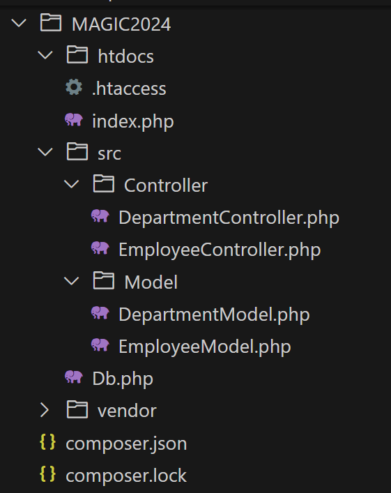


## Db Class
The Db class will create the connection to the database.  
➡️ In the `/src/Db.php` file enter the following:  
⚠️ Don't forget to use *your* user and password.  
```
<?php

namespace App;

use \PDO;

class Db
{
    public function connect()
    {
        $dsn = '*LOCAL';     // Use the *LOCAL DSN
        $user = 'userid';    // Use your userid
        $pwd = 'password';   // Use your password
        $naming = '1';       // NAM=1 means *SYS naming (uses the library list)
        $connection_string = "odbc:DSN={$dsn};NAM={$naming};UID={$user};PWD={$pwd}";
        $dbConn = NULL;
        
        try {
            $dbConn = new PDO($connection_string);
        } catch (PDOException $exception) {
            error_log($exception->getMessage());
        } 
    
        return $dbConn;
    }
}
```
All the PHP files still start with "<?php"  
We declare that this class is part of the "App" namespace (this is part of the auto-loading functionality).  
Since we're using classes and namespaces, we have to declare that we are using the PDO class to make the database connection.  
We create a class named Db that has a function called "connect".    
This function has the same code that we have been using all along.  


## Employee Model
The model is where we deal with the database.  
➡️ In `/src/Model/EmployeeModel.php` file enter the following:  
```
<?php

namespace App\Model;

use App\Db;
use \PDO;

class EmployeeModel
{

    public function get_all_employees()
    {
        $db = new Db();
        $dbConn = $db->connect();
        try {
            $sql = <<<SQL
                select 
                    empno as "id",
                    firstnme as "first",
                    lastname as "last",
                    job as "job",
                    workdept as "workdept",
                    salary as "salary"
                from SAMPLE.EMPLOYEE
            SQL;
            $query = $dbConn->prepare($sql);
            $query->execute(); 
            $employees = $query->fetchAll(PDO::FETCH_ASSOC);
            $returnObj = array(
                "length" => count($employees),
                "employees" => $employees
            );
            return $returnObj;
        } catch (PDOException $exception) {
            return null;
        } 
    }

    public function get_employee($empno)
    {
        $db = new Db();
        $dbConn = $db->connect();
        try {
            $sql = <<<SQL
                select 
                    empno as "id",
                    firstnme as "first",
                    lastname as "last",
                    job as "job",
                    workdept as "workdept",
                    salary as "salary"
                from SAMPLE.EMPLOYEE
                where empno = ? 
            SQL;
            $query = $dbConn->prepare($sql);
            $query->bindParam(1, $empno);
            $query->execute(); 
            $employee = $query->fetch(PDO::FETCH_ASSOC);
            $returnObj = array(
                "employee" => $employee
            );
            return $returnObj;
        } catch (PDOException $exception) {
            return null;
        } 
    }
}
```
We declare the namespace and declare the other namespaces that we're going to be using.  
We create a class.  
Then we define a couple of functions that have nearly the same code that we had before.  

## Employee Controller  
The controller is where we will deal with the request and response.  
➡️ In `/src/Controller/EmployeeController.php` file enter the following:  
```
<?php

namespace App\Controller;

use Psr\Http\Message\ResponseInterface as Response;
use Psr\Http\Message\ServerRequestInterface as Request;
use App\Model\EmployeeModel;

class EmployeeController
{
    public function get_all_employees(Request $request, Response $response)
    {
        $model = new EmployeeModel();
        $employees = $model->get_all_employees();
        $response->getBody()->write(json_encode($employees));
        return $response;
    }

    public function get_employee(Request $request, Response $response, array $args)
    {
        $model = new EmployeeModel();
        $employee = $model->get_employee($args['id']);
        $response->getBody()->write(json_encode($employee));
        return $response;
    }
}
```  
In both functions we create (a.k.a. instantiate) the model class.  
Then we call the appropriate model fumction to get the employee data.  
Once we get the data returned from the model, we create the JSON and send it back in the response as before.  

## Front-Controller  
Now we need to update our front-controller.  
➡️ Update `index.php` so that it looks like this:  
```
<?php
use Psr\Http\Message\ResponseInterface as Response;
use Psr\Http\Message\ServerRequestInterface as Request;
use Slim\Factory\AppFactory;

use App\Controller\EmployeeController;

require __DIR__ . '/../vendor/autoload.php';

$app = AppFactory::create();

// Routes
$app->get('/employees', '\App\Controller\EmployeeController:get_all_employees');
$app->get('/employees/{id}', '\App\Controller\EmployeeController:get_employee');

// Run application
$app->run();
```
We declare the namespaces that we will be using (Response, Request, Slim AppFactory, and EmployeeController).  
Then we require the Composer autoloader.  
We use Slim to create the `$app`.  
Then we define the routes that we want the app to listen for.  
Each route will start with the method.  The "$app->get()" means both routes are listening for GET requests.  The first parameter to the get() function is the URL Path that the route should match.  The second parameter is the class and function that should be called.  
A GET request to the "/employees" route will call the get_all_emmployees function in the EmployeeController class.  
You can include URL Path parameters in the route, as shown in the second route "/employees/{id}".  


## Autoloading  
Now we need to register our App namespace with the autoloader.   
➡️ Update `composer.json` so that it looks like this:  
```
{
    "require": {
        "slim/slim": "^4.14",
        "slim/psr7": "^1.7"
    },
    "autoload" : {
        "psr-4":{
            "App\\" : "src/"
        }
    }
}
```
This tells the autoloader that the files for the App namespace are located in the /src directory.  

Now we need to update the generated autoload files.  
➡️ In the terminal type `composer dump-autoload` and then press &lt;Enter&gt;:   
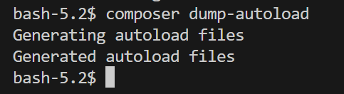    


We should now be ready to test the employee routes.  
<br>➡️ Open your browser and go to `http://magic.magic-ug.org:{your_port}/employees`  

You should see something like this:  
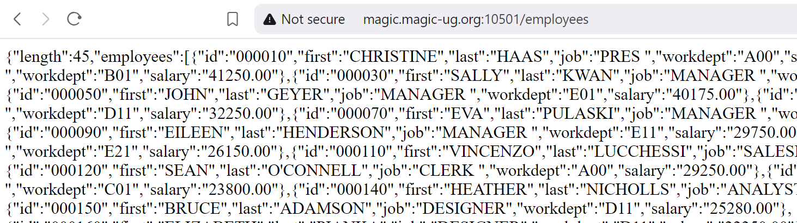  
<br>➡️ Open your browser and go to `http://magic.magic-ug.org:{your_port}/employees/000090`  

You should see something like this:  
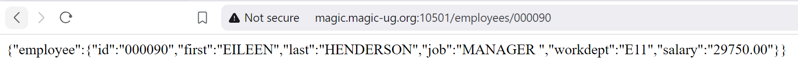  


## 🚀 Congratulations!
We have just converted our app to use the Slim framework!!  
It might not seem worth it at this point for this fairly simple app.  
Keep in mind that we only have a total of 8 routes and a single URL Path parameter at most.  Apps can often have many more routes, and often have multiple path parameters for individual routes.  For a more complex app our front-controller would quickly become unmanageable.  
In the next section we look at how to access the request body so we can add employees.    
