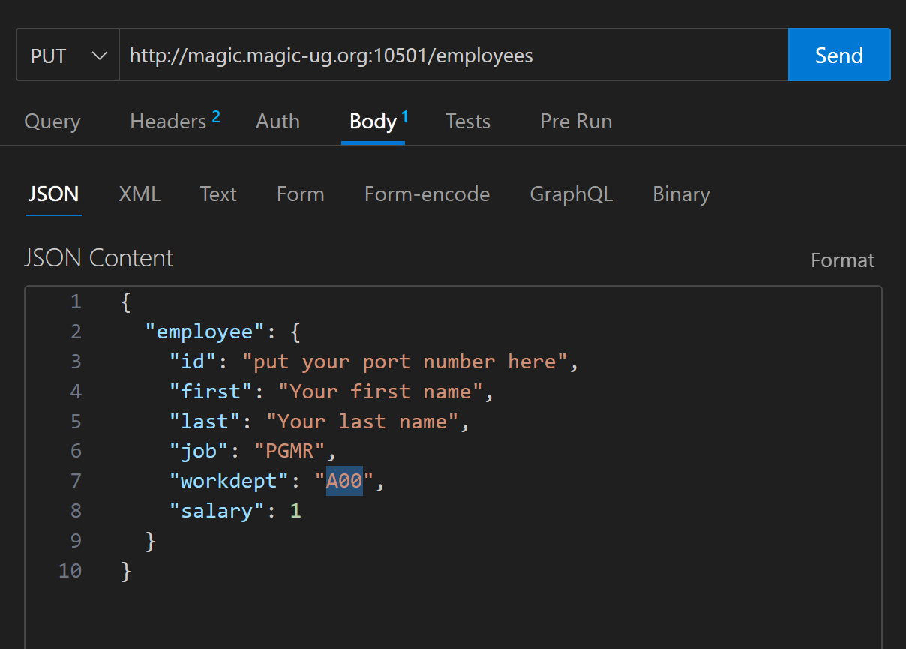

# Reqeust Body

Now we want to access the request body so that we can add/update employees. 

## Front Controller
First we will add a `PUT` route to the front-controller.

➡️ Update `index.php` so that it looks like this:  
```
<?php
use Psr\Http\Message\ResponseInterface as Response;
use Psr\Http\Message\ServerRequestInterface as Request;
use Slim\Factory\AppFactory;

use App\Controller\EmployeeController;

require __DIR__ . '/../vendor/autoload.php';

$app = AppFactory::create();

// Routes
$app->get('/employees', '\App\Controller\EmployeeController:get_all_employees');
$app->get('/employees/{id}', '\App\Controller\EmployeeController:get_employee');
$app->put('/employees', '\App\Controller\EmployeeController:add_employee');

// Run application
$app->run();
```
Notice that we now have a route for `$app->put`.  This route will call the `add_employee` function in the EmployeeController.  
That function doesn't exist yet, so let's add that.  


## Employee Controller

➡️ In `src/Controller/EmployeeController.php` add an `add_employee` function:  
⚠️Don't modify the other functions, just add `add_employee`  
```
<?php

namespace App\Controller;

use Psr\Http\Message\ResponseInterface as Response;
use Psr\Http\Message\ServerRequestInterface as Request;
use App\Model\EmployeeModel;

class EmployeeController
{
    public function get_all_employees(Request $request, Response $response)
    {
        LEAVE THIS ALONE
    }

    public function get_employee(Request $request, Response $response, array $args)
    {
        LEAVE THIS ALONE
    }

    public function add_employee(Request $request, Response $response, array $args)
    {
        $requestBody = json_decode(file_get_contents('php://input'), true);
        $model = new EmployeeModel();
        $employee = $model->add_employee($requestBody["employee"]);
        $response->getBody()->write(json_encode($employee));
        return $response;
    }
}
```
The controller function reads the request body and decodes the JSON into a PHP array.  
It sends the request body to the EmployeeModel class, so we had better implement that next.  


## Employee Model  

➡️ In `src/Model/EmployeeModel.php` add an `add_employee` function:  
⚠️Don't modify the other functions, just add `add_employee` 
```
<?php

namespace App\Model;

use App\Db;
use \PDO;

class EmployeeModel
{

    public function get_all_employees()
    {
       LEAVE THIS ALONE 
    }

    public function get_employee($empno)
    {
        LEAVE THIS ALONE
    }

    public function add_employee($employee)
    {
        
        $empno    = $employee["id"];
        $firstnme = $employee["first"];
        $lastname = $employee["last"];
        $workdept = $employee["workdept"];
        $job      = $employee["job"];
        $salary   = $employee["salary"];
        $edlevel  = 0;
        $midinit  = '';

        $db = new Db();
        $dbConn = $db->connect();
        $sql = <<<SQL
            insert into sample.employee
            (EMPNO, FIRSTNME, MIDINIT, LASTNAME, WORKDEPT, JOB, SALARY, EDLEVEL)
            VALUES
            ('$empno', '$firstnme', '$midinit', '$lastname', '$workdept', '$job', $salary, $edlevel)
        SQL;
        
        $query = $dbConn->prepare($sql);
        $query->execute(); 

        return $employee;
    }    
}
```


## PUT Request
We can't make a PUT request with the browser, so we will use ThunderClient or Postman in VS Code.  


➡️ Open Postman or ThunderClient and make a put request:  
⚠️Be sure to use your own port number in the URL, and update the request body!  
  


➡️ Open your browser and go to `http://magic.magic-ug.org:{your_port}/employees/{your port number}`  

You should see get back your employee information


## 🚀 Congratulations!
You made it to the end of the workshop!  
There's still lots to do for the app though, like add the `PATCH` functionality, and validate the input.  You should have the skills to do that on your own (maybe with a little help from Google or CoPilot).  
